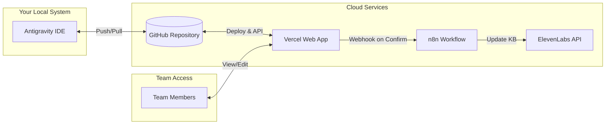
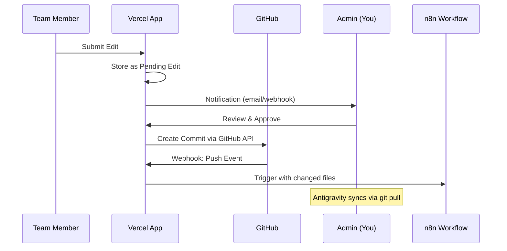
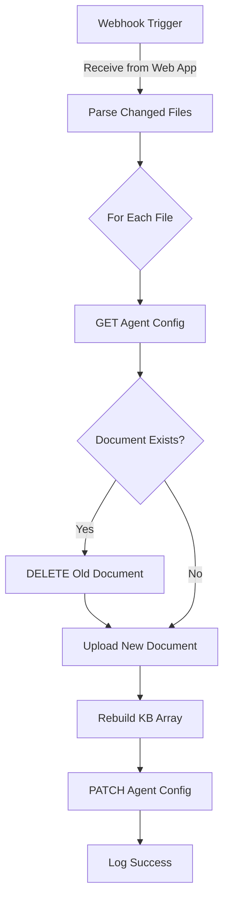

# Team Knowledge Base Portal

A two-stage system for team collaboration on knowledge base documents with GitHub sync and ElevenLabs AI agent integration.

---

## Overview

This project enables your team to view, edit, and manage knowledge base markdown files through a secure web portal. Changes sync bi-directionally with GitHub and update ElevenLabs AI agents automatically.



---

## Stage 1: Team Knowledge Base Portal

### 1.1 Web Application Stack

| Component | Technology | Purpose |
|-----------|------------|---------|
| **Framework** | Next.js 14+ (App Router) | Server-side rendering, API routes |
| **Styling** | CSS + Modern UI | Premium, responsive design |
| **Authentication** | NextAuth.js | Username/password with session management |
| **Markdown** | react-markdown + remark-gfm | Render and parse markdown |
| **Editor** | Monaco Editor or CodeMirror | Rich markdown editing experience |
| **Deployment** | Vercel | Automatic GitHub deployment |
| **Database** | Vercel KV or file-based | Store pending edits, user sessions |

---

### 1.2 Core Features

#### **File Browser**
- Display folder structure matching `PUBLISHED FOLDERS MASTER/`
  - 📁 Blogs (32 files)
  - 📁 Customer Related (2 files)
  - 📁 Products Related → 5 elements, General FAQs, Products
- Tree navigation with collapsible folders
- Search across all documents

#### **Document Viewer**
- Beautiful markdown rendering
- Syntax highlighting for code blocks
- Table of contents sidebar
- Mobile-responsive layout

#### **Edit Mode** (Authenticated Users)
- Click "Edit" button to enter edit mode
- Side-by-side preview or toggle view
- Save creates a "pending edit" (not direct commit)
- Your confirmation required before changes go live

#### **Auth System**
- Simple username/password login
- Role-based access:
  - **Admin (You)**: Can approve/reject edits, manage users
  - **Editor**: Can view all, submit edit requests
  - **Viewer**: Read-only access

---

### 1.3 GitHub Integration Flow



**Two-way sync mechanism:**
1. **Web → GitHub**: Approved edits create commits via GitHub API
2. **GitHub → Web**: Vercel auto-deploys on every push (your local changes included)

---

### 1.4 Proposed File Structure

```
Team Checking System/
├── app/
│   ├── layout.tsx              # Root layout
│   ├── page.tsx                # Landing/login page
│   ├── (auth)/
│   │   ├── login/page.tsx
│   │   └── logout/page.tsx
│   ├── (portal)/
│   │   ├── layout.tsx          # Authenticated layout
│   │   ├── dashboard/page.tsx  # Overview/stats
│   │   ├── browse/
│   │   │   ├── page.tsx        # File browser
│   │   │   └── [...path]/page.tsx  # Dynamic file view
│   │   └── pending/page.tsx    # Pending edits (admin)
│   └── api/
│       ├── auth/[...nextauth]/route.ts
│       ├── files/
│       │   ├── route.ts        # List files
│       │   └── [path]/route.ts # Get/update file
│       ├── edits/
│       │   ├── route.ts        # Submit edit
│       │   └── [id]/
│       │       ├── approve/route.ts
│       │       └── reject/route.ts
│       └── webhook/
│           └── n8n/route.ts    # Trigger n8n on approval
├── components/
│   ├── FileTree.tsx
│   ├── MarkdownViewer.tsx
│   ├── MarkdownEditor.tsx
│   ├── PendingEditsList.tsx
│   └── ui/                     # Common UI components
├── lib/
│   ├── github.ts               # GitHub API utilities
│   ├── auth.ts                 # NextAuth config
│   └── store.ts                # Pending edits storage
├── styles/
│   └── globals.css
├── public/
├── package.json
├── next.config.js
└── vercel.json
```

---

### 1.5 Environment Variables Required

```env
# GitHub API (for commits)
GITHUB_TOKEN=ghp_xxxxxxxxxxxxxxxxxxxx
GITHUB_OWNER=your-github-username
GITHUB_REPO=your-repo-name
GITHUB_BRANCH=main

# Authentication (Simple hardcoded user list)
NEXTAUTH_SECRET=your-secret-key
NEXTAUTH_URL=https://your-app.vercel.app

# Users - Format: username:password_hash:role (comma-separated for multiple)
# Roles: admin, editor, viewer
USERS=admin:$2b$10$hashedpassword:admin,editor1:$2b$10$hashedpassword:editor

# n8n Workflow (Hostinger hosted)
N8N_BASE_URL=https://n8n.srv1255158.hstgr.cloud
N8N_WEBHOOK_URL=https://n8n.srv1255158.hstgr.cloud/webhook/kb-update
N8N_API_KEY=eyJhbGciOiJIUzI1NiIsInR5cCI6IkpXVCJ9...

# Approval Notification Webhook (to be configured later)
NOTIFICATION_WEBHOOK_URL=

# ElevenLabs Sub-Agents Configuration
# Add agent IDs as needed - these will be used for KB sync
ELEVENLABS_API_KEY=your-elevenlabs-api-key
ELEVENLABS_SUB_AGENT_1=agent_id_1
ELEVENLABS_SUB_AGENT_2=agent_id_2
ELEVENLABS_SUB_AGENT_3=agent_id_3
# Add more as needed: ELEVENLABS_SUB_AGENT_4, ELEVENLABS_SUB_AGENT_5, etc.
```

---

## Stage 2: ElevenLabs Knowledge Base Sync via n8n

### 2.1 n8n Workflow Design

Based on your [reference workflow](file:///c:/Users/User/OneDrive%20-%20ZenCleanz/ZENCLEANZ%20-%20MASTER%20FOLDER/ZC%20Brain/ZCBRAIN%20KNOWLEDGE%20BASE/Punlished%20Markdown%20Files/TEMP/n8n-eleven-googledocs-update.md), adapted for GitHub + Web App:



---

### 2.2 ElevenLabs API Endpoints Used

| Action | Endpoint | Method |
|--------|----------|--------|
| Get Agent Config | `/v1/convai/agents/{agent_id}` | GET |
| List KB Documents | `/v1/convai/knowledge-base` | GET |
| Delete Document | `/v1/convai/knowledge-base/{doc_id}` | DELETE |
| Upload File | `/v1/convai/knowledge-base/file` | POST |
| Update Agent KB | `/v1/convai/agents/{agent_id}` | PATCH |

---

### 2.3 n8n Workflow Nodes

1. **Webhook Node** - Receives payload from web app:
   ```json
   {
     "action": "update",
     "files": [
       { "path": "Blogs/THE_FINE_ART_OF_DETOX.md", "name": "THE_FINE_ART_OF_DETOX" }
     ],
     "agent_id": "your-agent-id",
     "content": "..."
   }
   ```

2. **HTTP Request Node** - GET `/v1/convai/agents/{agent_id}`
   - Headers: `xi-api-key: YOUR_ELEVENLABS_API_KEY`

3. **Code Node** - Check if document exists in KB array

4. **IF Node** - Branch on document existence

5. **HTTP Request Node** - DELETE old document (if exists)

6. **HTTP Request Node** - POST new document (multipart/form-data)

7. **Code Node** - Rebuild KB array with new document ID

8. **HTTP Request Node** - PATCH agent config with updated KB

---

### 2.4 Agent & Document Mapping (Environment Variable Based)

Sub-agents are configured via environment variables. The n8n workflow will read these and update all relevant agents when documents change:

```env
# In your .env file - add as many sub-agents as needed
ELEVENLABS_SUB_AGENT_1=agent_id_here
ELEVENLABS_SUB_AGENT_2=agent_id_here
ELEVENLABS_SUB_AGENT_3=agent_id_here
# ... add more: ELEVENLABS_SUB_AGENT_4, ELEVENLABS_SUB_AGENT_5, etc.
```

The system will automatically detect all `ELEVENLABS_SUB_AGENT_*` environment variables and update each agent's knowledge base when documents are approved.

---

## Confirmed Decisions ✅

> [!NOTE]
> **Authentication Approach**: ✅ Simple hardcoded user list stored in environment variables. Users format: `username:password_hash:role`

> [!NOTE]
> **Approval Workflow**: ✅ Webhook notification (URL to be configured later via `NOTIFICATION_WEBHOOK_URL` env var)

> [!NOTE]
> **Agent Mapping**: ✅ Multiple ElevenLabs sub-agents, configured via environment variables (`ELEVENLABS_SUB_AGENT_1`, `ELEVENLABS_SUB_AGENT_2`, etc.)

> [!NOTE]
> **n8n Instance**: ✅ Self-hosted on Hostinger at `https://n8n.srv1255158.hstgr.cloud`
> - Workflow URL: [https://n8n.srv1255158.hstgr.cloud/workflow/74KRa8KF7dY3Z-OXdBMpp](https://n8n.srv1255158.hstgr.cloud/workflow/74KRa8KF7dY3Z-OXdBMpp)

---

## Implementation Timeline

### Stage 1: Web Portal (Estimated: 3-4 days)

| Phase | Tasks | Duration |
|-------|-------|----------|
| **1.1** | Project setup, Next.js boilerplate, folder structure | Day 1 |
| **1.2** | File browser component, markdown viewer | Day 1-2 |
| **1.3** | Authentication with NextAuth.js | Day 2 |
| **1.4** | Edit mode, pending edits system | Day 2-3 |
| **1.5** | GitHub API integration (commits) | Day 3 |
| **1.6** | Admin approval workflow | Day 3-4 |
| **1.7** | Styling, polish, testing | Day 4 |

### Stage 2: n8n + ElevenLabs Integration (Estimated: 1-2 days)

| Phase | Tasks | Duration |
|-------|-------|----------|
| **2.1** | Create n8n webhook workflow | Day 1 |
| **2.2** | Implement ElevenLabs API calls | Day 1 |
| **2.3** | Connect web app webhook trigger | Day 1-2 |
| **2.4** | Testing with real documents | Day 2 |

---

## Verification Plan

### Automated Tests
- Unit tests for GitHub API functions
- Integration test for the full edit → approve → commit flow
- n8n workflow can be tested with manual webhook triggers

### Manual Verification
1. **File browsing**: Navigate through all folders, view markdown rendering
2. **Edit flow**: Submit edit as team member → review as admin → approve → verify GitHub commit
3. **Sync test**: Make local change in Antigravity → push → verify Vercel redeployment
4. **n8n integration**: Approve edit → verify ElevenLabs agent KB is updated

---

## Next Steps

Once you approve this plan:

1. I'll create the Next.js project structure in `Team Checking System/`
2. Build the file browser and markdown viewer first (visible progress)
3. Add authentication and edit functionality
4. Connect GitHub API for commits
5. Finally, build the n8n workflow for ElevenLabs integration

Let me know if you'd like to adjust any aspect of this architecture!
